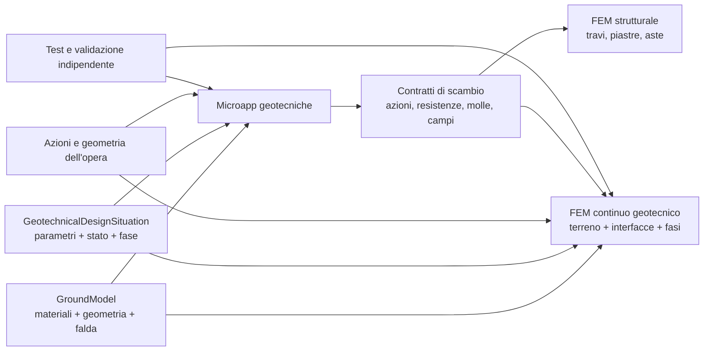

# Progressione delle microapp geotecniche verso il FEM completo

## 1. Obiettivo del documento

Questo documento è il canovaccio tecnico per sviluppare la geotecnica in
`strutture-js` senza creare calcolatori isolati e senza compromettere il
modello FEM geotecnico-strutturale finale.

Ha tre funzioni:

1. fissare quali primitive devono essere condivise;
2. ordinare le microapp in base alle dipendenze reali, non alla sola facilità
   di implementazione;
3. fare in modo che ogni incremento produca dati, test e kernel riutilizzabili
   nel successivo modello accoppiato.

Non è una dichiarazione di funzionalità già disponibili. Le sezioni distinguono
sempre stato corrente, prossimo incremento e obiettivo futuro. Non vengono
assegnate scadenze: la progressione è governata da dipendenze e criteri di
completezza tecnica.

## 2. Visione finale

La destinazione non è una singola app monolitica, ma un nucleo comune capace
di alimentare due famiglie di consumer:

- microapp verticali, leggibili e verificabili, per problemi geotecnici ben
  delimitati;
- un modello FEM accoppiato terreno-struttura, con costruzione per fasi,
  non linearità, interfacce e stato tensionale iniziale.

Le microapp restano utili anche dopo l'arrivo del FEM completo. Forniscono:

- predimensionamento e controlli indipendenti;
- benchmark del modello numerico;
- analisi parametriche rapide;
- spiegabilità di resistenze e meccanismi;
- alternative robuste quando un'analisi avanzata non è giustificata.

Il FEM non deve diventare una scorciatoia per evitare i modelli di dominio. Al
contrario, mesh, materiali, interfacce e fasi dovranno essere generati a partire
dagli stessi contratti già usati dalle microapp.



## 3. Principi architetturali non negoziabili

### 3.1 Un solo modello del sito

Stratigrafia, materiali, falda e provenienza non devono essere ricreati dentro
ogni microapp. Il riferimento comune è `GroundModel`; una microapp può
richiedere una vista 1D (`GroundProfile`) o 2D (`GroundSection2D`) senza
duplicare i dati.

### 3.2 Situazione di calcolo separata dal sito

Il sito non cambia quando si passa da breve a lungo termine, da SLS a ULS o da
condizione persistente a sismica. Cambiano i parametri selezionati, il campo di
pressione interstiziale, la fase e le regole normative: questo è il ruolo di
`GeotechnicalDesignSituation`.

### 3.3 Geotecnica e struttura si scambiano contratti, non dipendenze circolari

Un'applicazione geotecnica non deve conoscere il modello di una specifica UI o
di uno specifico programma strutturale. Deve consumare e produrre oggetti
serializzabili, per esempio:

- distribuzione di pressione su una linea o superficie;
- risultante e punto di applicazione;
- capacità e domanda con convenzioni di segno;
- curva forza-spostamento o momento-rotazione;
- legge di molla locale;
- stato di contatto;
- azioni trasmesse alla fondazione;
- reazioni trasmesse alla sovrastruttura.

### 3.4 Separare metodo fisico e applicazione normativa

Il kernel di dominio contiene geometria, equilibrio, integrazione e algoritmi
generali. `src/norms` contiene coefficienti, combinazioni, approcci di progetto
e limitazioni dipendenti dalla norma. `src/applications` orchestra input,
kernel, adapter normativi e risultati.

La direzione delle dipendenze resta `applications -> norms -> domain`.

### 3.5 Nessuna capacità apparente

Un DTO futuro o un'interfaccia predisposta non costituiscono
un'implementazione. Un ramo privo di kernel e validazione deve restituire
`not-implemented`; un metodo esistente fuori dal proprio campo deve restituire
`not-supported` con motivazione.

### 3.6 Ogni formula entra con fonte e verifica indipendente

Ogni incremento numerico deve dichiarare:

- fonte primaria o riferimento tecnico verificabile;
- unità e segni;
- ipotesi e campo di validità;
- confronto con aritmetica indipendente, soluzione chiusa, esempio pubblicato
  o altro software validato;
- regressioni sui casi limite.

## 4. Baseline disponibile

### 4.1 Dominio del terreno

| Componente | Stato | Uso attuale |
| --- | --- | --- |
| `SoilMaterial` | implementato nel perimetro corrente | Pesi di volume, set drenati/non drenati, resistenza, `K0`, base e provenienza. |
| catalogo tipologie di terreno | implementato come tassonomia | Classificazione e creazione di materiali manualmente parametrizzati; nessun valore sito-specifico implicito. |
| `GroundProfile` | implementato | Stratigrafia 1D orizzontale e falda idrostatica. |
| `GroundSection2D` | implementato v1 | Superficie e zone poligonali non sovrapposte, query spaziali. |
| `PorePressureField2D` | implementato v1 | Assente, idrostatico orizzontale, linea freatica, griglia assegnata. |
| `GroundModel` | implementato v1 | Libreria canonica, profili, sezioni, campi idraulici e default espliciti. |
| `GeotechnicalDesignSituation` | implementato v1 | Selezione tracciabile di stato, drenaggio, base, parametri, campo, fase e sisma pseudostatico. |
| `SoilStructureInterface` | implementato nel perimetro corrente | Attrito parete-terreno assegnato o raccomandazione indicativa autorizzata. |

Questa baseline chiude il modello di input necessario alla prima microapp 2D.
Non chiude il dominio geotecnico in senso assoluto: deformabilità, idraulica,
consolidazione e leggi costitutive entreranno quando richieste da applicazioni
concrete.

### 4.2 Calcoli geotecnici già disponibili

`geotechnical-earth-pressures` copre, nel campo documentato:

- Rankine attiva e passiva stratificata;
- condizioni drenate e non drenate in tensioni totali;
- pressione a riposo assegnata o Jaky per terreno normalmente consolidato;
- Coulomb attiva e passiva omogenea, superficie e parete planari inclinate;
- attrito parete-terreno;
- Mononobe-Okabe attiva omogenea;
- cuneo pseudo-statico a inclinazione costante per stratigrafia orizzontale,
  parete planare inclinata e attritiva.

Non è ancora un workflow completo di muro, paratia o pendio.

### 4.3 Integrazione strutturale disponibile

- Il FEM corrente è prevalentemente strutturale a elementi monodimensionali e
  non contiene un continuo geotecnico.
- Il plinto in calcestruzzo armato accetta resistenze geotecniche assegnate; non
  le calcola dal `GroundModel`.
- La trave di fondazione usa un modulo di sottofondo assegnato; non lo deriva
  dal terreno.
- `micropiles-broms` è uno scaffold e non deve essere considerato una capacità
  laterale disponibile. La sua funzione dovrà essere assorbita in una
  applicazione generica per fondazioni profonde.

## 5. Contratto comune di una microapp

Ogni microapp geotecnica dovrebbe ricevere almeno:

```text
groundModel
designSituation
geometry / structuralElement
actions
analysisOptions
units
```

e restituire un risultato serializzabile coerente con:

```text
status
summary
outputs
checks
warnings
assumptions
metadata
demand
capacity
utilizationRatio
```

Non tutti i campi sono obbligatori per un'analisi senza verifica, ma la
semantica deve restare uniforme.

### 5.1 Metadati minimi del risultato

Ogni risultato dovrebbe registrare:

- `groundModelId` e `designSituationId`;
- versione degli schemi consumati;
- norma e versione dell'adapter, se presenti;
- set di parametri effettivamente risolti e relativa provenienza;
- sistema di unità interno e di input;
- metodo e opzioni numeriche;
- fase costruttiva;
- convenzioni di segno e assi;
- fonte tecnica del kernel;
- hash o identificatore del caso, se introdotto in futuro dal consumer.

### 5.2 Contratti di scambio da introdurre solo quando consumati

I seguenti nomi descrivono direzioni di progetto, non classi oggi disponibili:

| Contratto futuro | Primo consumer | Riutilizzo FEM |
| --- | --- | --- |
| `GroundActionField2D` | muro/paratia | Carichi distribuiti su elementi strutturali e interfacce. |
| `FoundationActionSet` | fondazioni superficiali/profonde | Mapping nodo-fondazione e ritorno delle reazioni. |
| `ContactPressureField` | fondazioni superficiali | Contatto piastra-terreno e benchmark del continuo. |
| `SoilSpringLaw` | fondazioni e paratie | Elementi molla non lineari e modelli ridotti. |
| `PileTransferLaw` | pali assiali/laterali | Curve `t-z`, `q-z`, `p-y` o equivalenti, con fonte dichiarata. |
| `SoilStructureInterfaceLaw` | muro/paratia/FEM | Contatto, attrito, apertura e scorrimento. |
| `ConstructionStage` | paratie/FEM | Attivazione di terreno, elementi, carichi e condizioni idrauliche. |
| `InitialStressState` | FEM continuo | Stato geostatico coerente prima della costruzione. |

Questi contratti devono essere aggiunti quando il primo algoritmo li produce
o consuma, evitando scaffold privi di comportamento.

## 6. Ordine strategico

L'ordine raccomandato è:

1. stabilità del pendio;
2. fondazioni superficiali;
3. muro di sostegno completo;
4. fondazioni profonde: capacità verticale;
5. fondazioni profonde: risposta laterale;
6. paratie e scavi sostenuti;
7. applicazioni specialistiche;
8. FEM continuo geotecnico e accoppiamento completo.

Il muro può essere anticipato rispetto alle fondazioni superficiali se la
priorità di prodotto lo richiede: gran parte del kernel di spinta esiste già.
Dal punto di vista del modello finale, tuttavia, la fondazione superficiale
introduce prima i contratti generali di contatto, cedimento e scambio di azioni
con la sovrastruttura, riutilizzabili anche dal muro.

La stabilità del pendio resta la prima applicazione perché mette alla prova
`GroundSection2D`, `PorePressureField2D`, selezione dei parametri e ricerca
geometrica senza dipendere ancora dal FEM strutturale.

## 7. Microapp 1 — Stabilità del pendio

### 7.1 Collocazione

La stabilità del pendio è una nuova applicazione geotecnica, non un nuovo
modello del terreno e non un modulo strutturale. Consuma:

- `GroundModel` con una `GroundSection2D`;
- `PorePressureField2D` selezionato;
- `GeotechnicalDesignSituation`;
- sovraccarichi, eventuali azioni sismiche e vincoli di ricerca specifici.

Percorso previsto: `src/applications/geotechnical-slope-stability`.

### 7.2 Primo perimetro implementabile

Il primo incremento dovrebbe coprire:

- sezione 2D in deformazione piana;
- superfici di scorrimento circolari;
- terreni drenati Mohr-Coulomb e non drenati in tensioni totali;
- pressione interstiziale letta dal campo 2D;
- sovraccarichi verticali distribuiti sulla superficie;
- metodo delle strisce con almeno un metodo semplificato e un metodo di
  equilibrio più completo, scelti dopo aver fissato le fonti;
- ricerca controllata della superficie critica;
- restituzione della superficie, delle strisce, dei contributi e del fattore
  di sicurezza;
- analisi pseudostatica come incremento successivo del medesimo workflow.

USACE EM 1110-2-1902 è una base primaria per metodi, pressioni interstiziali,
selezione dei parametri, ricerca e interpretazione:
[USACE, Slope Stability](https://www.publications.usace.army.mil/Portals/76/Publications/EngineerManuals/EM_1110-2-1902.pdf).

La scelta dei metodi specifici e delle relative equazioni deve essere
formalizzata nel documento metodologico prima del codice; questo piano non
sostituisce la fonte.

### 7.3 Oggetti di dominio necessari

- `SlipSurface2D`: geometria interrogabile e punti di intersezione;
- `SliceDiscretization2D`: strisce, basi, pesi, materiali e pressioni;
- `SlopeLoad2D`: sovraccarico, forza o linea di carico con convenzione unica;
- `SlopeStabilityProblem`: riferimenti e opzioni di ricerca;
- risultato della singola superficie separato dal risultato di ricerca.

Vanno introdotti quando implementati, senza classi vuote.

### 7.4 Sequenza interna

1. intersecare la superficie di scorrimento con topografia e zone;
2. discretizzare la massa in strisce senza perdere i passaggi di materiale;
3. integrare peso e sovraccarichi;
4. interrogare `PorePressureField2D` alla base con la convenzione documentata;
5. risolvere l'equilibrio per la superficie assegnata;
6. verificare convergenza e ammissibilità;
7. ripetere sulla famiglia di ricerca;
8. restituire minimo, alternative vicine e diagnostica.

### 7.5 Casi limite da presidiare

- superficie che non intercetta due volte il piano campagna;
- striscia a larghezza o base quasi nulla;
- base sul confine di due materiali;
- campo di pressione fuori dominio;
- terreno con set drenato/non drenato incompatibile;
- resistenza nulla o geometria non equilibrabile;
- superficie che attraversa un vuoto di `GroundSection2D`;
- mancata convergenza dell'equilibrio o della ricerca;
- più minimi locali quasi equivalenti.

### 7.6 Validazione

La campagna deve crescere per livelli:

- pendio omogeneo asciutto con benchmark pubblicato;
- falda orizzontale;
- stratigrafia a due materiali;
- coesione e attrito;
- caso non drenato;
- convergenza al raffinamento delle strisce;
- ricerca che recupera una superficie critica nota;
- confronto fra metodi e spiegazione delle differenze;
- pseudostatica, solo dopo la validazione statica.

### 7.7 Ponte al FEM

La microapp fornisce al FEM futuro:

- benchmark per la riduzione della resistenza al taglio;
- geometria della zona critica;
- selezione dei parametri e campo idraulico;
- controllo indipendente del fattore di sicurezza;
- casi di regressione per topografia, stratigrafia e inizializzazione geostatica.

Il FEM non riutilizzerà l'equilibrio delle strisce come elemento; riutilizzerà
gli input, le query geometriche e la validazione globale.

### 7.8 Definizione di completo

La prima versione è completa solo quando:

- tutte le grandezze sono serializzabili e tracciate;
- il metodo di una superficie e la ricerca sono testabili separatamente;
- esistono benchmark indipendenti;
- il raffinamento delle strisce è documentato;
- i fallimenti numerici sono distinti dai casi fisicamente non supportati;
- esiste un documento metodologico con campo di validità.

## 8. Microapp 2 — Fondazioni superficiali

### 8.1 Obiettivo

Collegare il `GroundModel` alle fondazioni e ai moduli strutturali esistenti,
calcolando resistenza geotecnica e, in un incremento distinto, deformazioni.

Percorso previsto: `src/applications/geotechnical-shallow-foundations`.

### 8.2 Separare ULS e SLS

La capacità portante e il cedimento non devono essere compressi in una sola
funzione. Richiedono parametri, modelli e livelli di validazione differenti.

Incremento ULS:

- fondazione rettangolare, nastriforme e circolare;
- azione verticale, taglio e momento assegnati;
- eccentricità e area efficace nel campo della fonte scelta;
- resistenza della base e scorrimento;
- terreno stratificato con regole dichiarate, inizialmente limitate;
- falda e peso efficace;
- confronto domanda/capacità con adapter normativo.

Incremento SLS:

- cedimento immediato;
- distribuzione di tensione nel sottosuolo;
- deformabilità drenata/non drenata esplicitamente selezionata;
- cedimento differenziale e rotazione;
- consolidazione solo in un incremento autonomo, dopo dati idraulici e
  compressibilità adeguati.

Riferimento generale e guide ufficiali:
[FHWA, Geotechnical Engineering — Foundations](https://www.fhwa.dot.gov/engineering/geotech/foundations/)
e
[FHWA GEC 6, Shallow Foundations](https://www.fhwa.dot.gov/engineering/geotech/pubs/010943.pdf).

### 8.3 Integrazione strutturale

Il workflow deve accettare le azioni al nodo o alla base della struttura e
produrre:

- resistenze geotecniche da passare alla verifica del plinto RC;
- campo o distribuzione di contatto da confrontare con il modello rigido
  strutturale;
- rigidezze secanti o leggi di molla, se giustificate dal metodo;
- cedimento e rotazione da applicare alla sovrastruttura;
- reazioni di ritorno con convenzioni univoche.

Il plinto RC esistente non deve importare internamente la microapp geotecnica.
Un orchestratore applicativo compone i due risultati, consentendo anche l'uso
separato.

### 8.4 Ponte al FEM

Questo modulo prepara:

- contatto monolatero fondazione-terreno;
- calibrazione di molle verticali e orizzontali;
- confronto piastra rigida/continua;
- trasferimento bidirezionale di azioni e spostamenti;
- benchmark del continuo sotto fondazione.

## 9. Microapp 3 — Muro di sostegno completo

### 9.1 Riutilizzo immediato

Il kernel delle spinte è già disponibile. Manca l'orchestrazione dell'opera:

- geometria di muro, mensola, fondazione e terreno a monte/valle;
- peso proprio e sovraccarichi;
- combinazioni di pressione attiva, a riposo, passiva, acqua e sisma;
- stabilità a scorrimento, ribaltamento e capacità portante;
- stato di contatto sotto fondazione;
- verifica strutturale del fusto, della platea e degli elementi accessori;
- stabilità globale tramite la microapp pendio.

Percorso previsto: `src/applications/geotechnical-retaining-walls`, con
composizione esplicita verso le applicazioni RC o muratura pertinenti.

### 9.2 Distinzioni necessarie

- La spinta è un'azione, non la verifica del muro.
- La passiva disponibile deve essere ridotta o ammessa solo dall'adapter
  normativo e dalle condizioni geometriche dichiarate.
- La stabilità globale non è la somma delle verifiche locali: richiama il
  solver di pendio includendo l'opera nel problema.
- Pressione interstiziale, drenaggio e sovrappressione dietro il muro devono
  essere scenari espliciti.
- Parete inclinata e attrito parete-terreno devono essere trasformati in
  componenti coerenti con gli assi del muro e della fondazione.

### 9.3 Output verso la struttura

Il risultato geotecnico deve poter generare:

- carico distribuito lungo il fusto, con componenti normale e tangenziale;
- risultanti su mensola e chiave di taglio;
- pressioni di contatto sotto la platea;
- combinazioni/inviluppi di azioni interne richiesti alla verifica strutturale;
- domanda e capacità per le verifiche globali locali.

### 9.4 Ponte al FEM

Il muro è il primo caso di interfaccia estesa terreno-struttura. Prepara:

- elementi di contatto con apertura e attrito;
- attivazione della spinta in funzione dello spostamento;
- costruzione per fasi e reinterro;
- confronto tra pressioni limite e risposta deformativa;
- trasferimento delle pressioni dal continuo agli elementi strutturali.

## 10. Microapp 4 — Fondazioni profonde, capacità verticale

### 10.1 Perimetro progressivo

Il dominio deve rappresentare in modo generico palo, micropalo o elemento
profondo senza legarlo a un singolo metodo empirico.

Primo incremento:

- palo singolo verticale;
- geometria e tecnologia costruttiva dichiarate;
- stratigrafia lungo il fusto interrogata dal `GroundModel`;
- resistenza laterale di fusto e di base separate;
- compressione e trazione come casi distinti;
- effetti della falda;
- coefficienti e limiti forniti da un adapter normativo o metodologico;
- risultato ULS tracciabile per contributo e strato.

Incrementi successivi:

- cedimento e curva carico-cedimento;
- attrito negativo;
- gruppo di pali ed efficienza;
- plinto-pali e ripartizione delle azioni;
- pali inclinati;
- carico ciclico e degradazione, solo con modello e fonte specifici.

### 10.2 Interazione strutturale

La struttura fornisce l'azione alla testa; la geotecnica restituisce capacità,
spostamento o legge di trasferimento. La verifica strutturale del palo usa le
azioni interne risultanti, non sostituisce la verifica geotecnica.

Il contratto deve supportare due modalità:

- `capacity mode`: domanda/capacità per microapp;
- `response mode`: curve di trasferimento per un modello a molle o FEM.

### 10.3 Ponte al FEM

- leggi `t-z` e `q-z` o equivalenti, solo dopo scelta e validazione del metodo;
- elemento embedded o interfaccia asse-linea;
- accoppiamento plinto-gruppo;
- calibrazione della risposta assiale del continuo;
- stato tensionale iniziale e installazione.

## 11. Microapp 5 — Fondazioni profonde, risposta laterale

### 11.1 Obiettivo

Sostituire lo scaffold `micropiles-broms` con una applicazione generale e
versionata per pali soggetti a taglio e momento.

Progressione:

1. meccanismo limite per palo singolo nel campo della fonte scelta;
2. risposta elastica lineare come controllo;
3. metodo a trave su molle non lineari;
4. curve terreno-spostamento dipendenti da profondità e materiale;
5. carico ciclico, testa libera/incastrata e stratigrafia;
6. interazione di gruppo;
7. combinazione assiale-laterale, se coperta da fonti e dati adeguati.

Il nome Broms deve identificare un metodo selezionabile, non l'intera
applicazione.

### 11.2 Scambio con il FEM strutturale

Il modello ridotto naturale è una trave strutturale con molle geotecniche. Il
workflow deve poter produrre:

- discretizzazione lungo l'asse;
- legge di molla per stazione;
- condizioni alla testa;
- diagrammi di spostamento, rotazione, taglio e momento;
- reazioni del terreno;
- stato e tangente di ogni molla per il solutore non lineare.

Questo è il ponte più diretto tra microapp e FEM strutturale corrente.

### 11.3 Ponte al continuo

Le curve di molla restano un modello ridotto. Il FEM continuo servirà a:

- valutare meccanismi tridimensionali e di gruppo;
- modellare interfaccia e installazione;
- confrontare la distribuzione di reazione;
- calibrare o controllare i modelli ridotti senza renderli dipendenti dal FEM.

## 12. Microapp 6 — Paratie e scavi sostenuti

### 12.1 Dipendenze

Questa tappa viene dopo muri e pali laterali perché combina:

- pressione del terreno dipendente dal movimento;
- elementi strutturali flessionali;
- molle laterali non lineari;
- tiranti, puntoni e vincoli;
- fasi di scavo e variazioni di falda;
- stabilità globale e fondo scavo.

Percorso previsto: `src/applications/geotechnical-excavation-support`.

### 12.2 Prima versione

- paratia 2D come trave per unità di larghezza;
- strati e falda da `GroundModel`;
- fasi ordinate di scavo;
- vincoli o tiranti assegnati;
- pressione limite attiva/passiva dal kernel condiviso;
- modello a molle con legge e fonte esplicite;
- equilibrio e compatibilità non lineare;
- azioni nella paratia e reazioni dei sostegni;
- controlli di convergenza e sensibilità alla discretizzazione.

### 12.3 Incrementi

- tiranti con pretensione e prove;
- puntoni e telai di contrasto;
- fondo scavo, sifonamento e sollevamento;
- consolidazione e movimenti nel tempo;
- edifici adiacenti come carichi e vincoli;
- stabilità globale richiamando il solver di pendio;
- modelli apparenti di pressione come workflow distinti, non mescolati alle
  pressioni limite.

### 12.4 Ponte al FEM

La paratia obbliga a introdurre `ConstructionStage` come contratto operativo:
attivazione/disattivazione di terreno, elementi, carichi, sostegni e campi
idraulici. Questa stessa sequenza sarà consumata dal FEM continuo.

## 13. Applicazioni successive

L'ordine interno sarà deciso in base ai casi d'uso e alle dipendenze mature.

### 13.1 Stabilità idraulica e filtrazione

- campo di carico idraulico;
- flusso stazionario 2D;
- gradienti e portate;
- sollevamento, sifonamento ed erosione interna nel campo documentato;
- produzione di `PorePressureField2D` per le altre microapp.

Questa tappa è il precursore del FEM idromeccanico.

### 13.2 Consolidazione e cedimenti nel tempo

- parametri di compressibilità e permeabilità tipizzati;
- storia dei carichi;
- drenaggio mono/bidimensionale nel campo scelto;
- cedimento e pressione interstiziale nel tempo;
- validazione contro soluzioni analitiche prima dell'accoppiamento FEM.

### 13.3 Tiranti, chiodature e rinforzi

- elementi resistenti con aderenza, lunghezza libera e ancorata;
- interazione con pendio o paratia;
- fasi e pretensione;
- verifiche geotecniche e strutturali separate;
- output come elementi o interfacce del FEM.

### 13.4 Miglioramento del terreno

- zone migliorate come materiali o leggi equivalenti tracciate;
- colonne, inclusioni e drenaggi come geometrie specifiche;
- confronto ante/post;
- nessun parametro migliorato implicito senza base sperimentale.

### 13.5 Risposta sismica del sito e liquefazione

Devono essere moduli autonomi perché richiedono dati dinamici, stratigrafia,
falda, leggi cicliche e riferimenti normativi specifici. Non vanno inseriti
come opzioni marginali di Mononobe-Okabe.

### 13.6 Applicazioni 3D

- fondazioni combinate e platee;
- gruppi di pali;
- scavi e opere con effetti tridimensionali;
- stabilità 3D.

Queste richiedono prima un `GroundModel3D` o una generalizzazione compatibile;
non devono forzare coordinate 3D dentro lo schema `GroundSection2D/v1`.

## 14. Roadmap FEM in due binari

Il passaggio al FEM completo deve procedere su due binari che condividono dati
e test ma hanno complessità diversa.

### 14.1 Binario A — Modelli ridotti geotecnica-struttura

Usa il FEM strutturale esistente e introduce gradualmente:

1. carichi distribuiti generati dalle spinte;
2. molle lineari con unità e assi rigorosi;
3. contatto monolatero;
4. molle non lineari con stato e rigidezza tangente;
5. elementi trave su suolo per pali e paratie;
6. iterazione struttura-geotecnica;
7. fasi costruttive per attivazione di vincoli e carichi.

Vantaggi:

- riuso immediato del solutore e degli elementi strutturali;
- problemi più piccoli e risultati interpretabili;
- validazione mediante microapp e soluzioni chiuse;
- ponte operativo prima del continuo.

Limiti:

- il terreno è condensato in pressioni o molle;
- lo stato tensionale e i meccanismi nel volume non emergono;
- geometria 2D/3D e interazioni complesse sono approssimate.

### 14.2 Binario B — FEM continuo geotecnico

Richiede un sottosistema dedicato, non una semplice estensione degli elementi
trave. La progressione minima è:

#### Fase B1 — Elasticità continua verificata

- mesh 2D e topologia;
- elementi continui piani;
- quadratura e grandezze ai punti di integrazione;
- materiale elastico lineare;
- condizioni al contorno e carichi di volume;
- recupero di tensioni e reazioni;
- patch test, soluzioni elastiche e convergenza di mesh.

#### Fase B2 — Stato geostatico

- gravità e pesi di volume dal `GroundModel`;
- inizializzazione coerente delle tensioni;
- pressione interstiziale da `PorePressureField2D`;
- tensioni efficaci;
- equilibrio iniziale senza spostamenti artificiali significativi;
- gestione di `K0` e storia iniziale nel campo del modello.

#### Fase B3 — Non linearità del terreno

- interfaccia costitutiva indipendente dall'elemento;
- variabili di stato ai punti di integrazione;
- integrazione incrementale e tangente consistente o dichiarata;
- primo modello elasto-plastico selezionato con fonte e benchmark;
- controllo del passo, iterazione di Newton e diagnostica;
- dipendenza da drenaggio e tensioni efficaci.

#### Fase B4 — Interfacce e strutture

- elementi di interfaccia terreno-struttura;
- apertura/chiusura, attrito e scorrimento;
- compatibilità con travi, piastre e solidi strutturali;
- trasferimento di forze e momenti con segni comuni;
- verifica energetica e di equilibrio globale.

#### Fase B5 — Costruzione per fasi

- attivazione e disattivazione di elementi;
- scavo e reinterro;
- installazione di paratie, pali, tiranti e puntoni;
- variazione di carichi e falda;
- conservazione e inizializzazione dello stato nelle transizioni.

#### Fase B6 — Stabilità non lineare

- riduzione progressiva della resistenza nel campo del modello costitutivo;
- criterio di collasso numerico documentato;
- confronto sistematico con la microapp di stabilità;
- studio di dipendenza dalla mesh, dal passo e dalla tolleranza.

#### Fase B7 — Accoppiamento idromeccanico

- gradi di libertà di pressione interstiziale;
- permeabilità e continuità del fluido;
- formulazione accoppiata e stabilità numerica;
- consolidazione transitoria;
- validazione contro soluzioni analitiche e benchmark pubblici.

Una panoramica FHWA sull'uso degli elementi finiti in geotecnica e
sull'importanza della simulazione per fasi è disponibile in
[FHWA, Geotechnical Engineering Circular — finite-element modeling](https://www.fhwa.dot.gov/publications/research/infrastructure/10077/006.cfm).

### 14.3 Regola di convergenza dei due binari

Un contratto introdotto nel binario A deve essere pensato per poter diventare:

- condizione al contorno;
- elemento di interfaccia;
- legge costitutiva ridotta;
- risultato condensato del continuo.

Non deve però imitare prematuramente il FEM continuo. Una `SoilSpringLaw`
resta una legge di molla; non viene chiamata materiale continuo.

## 15. Evoluzione del modello dei materiali

`SoilMaterial` verrà esteso per capacità, non con un unico oggetto pieno di
campi opzionali. Blocchi candidati:

| Blocco futuro | Prima necessità | Contenuto indicativo da specificare con fonte |
| --- | --- | --- |
| deformabilità | fondazioni SLS | moduli, Poisson, dipendenza da tensione e drenaggio. |
| compressibilità | consolidazione | curve/indici e storia tensionale. |
| idraulica | filtrazione | permeabilità e anisotropia. |
| risposta laterale | pali/paratie | parametri del metodo di trasferimento selezionato. |
| costitutivo continuo | FEM | elasticità, plasticità, incrudimento e stato. |
| dinamica/ciclica | risposta sismica | rigidezza a piccole deformazioni, smorzamento, degradazione. |

Ogni blocco deve avere:

- `model` discriminante;
- unità;
- base e provenienza;
- parametri obbligatori per quel modello;
- validazione interna;
- versionamento;
- almeno un consumer reale e una campagna numerica.

## 16. Fasi costruttive

`constructionStageId` esiste già nella situazione di progetto come riferimento,
ma il motore delle fasi non è implementato.

Quando paratie o FEM lo richiederanno, `ConstructionStage` dovrà descrivere
delta di stato, non copie complete opache:

- elementi terreno attivati/disattivati;
- elementi strutturali e interfacce attivati/disattivati;
- carichi aggiunti/rimossi;
- vincoli aggiunti/rimossi;
- campo idraulico selezionato;
- pretensioni o stati iniziali;
- dipendenza dalla fase precedente.

Il grafo deve essere almeno una sequenza deterministica nella prima versione.
Ramificazioni di scenario possono essere gestite dal consumer usando più
sequenze, senza introdurre subito un orchestratore complesso nel dominio.

## 17. Interazione iterativa con la struttura

Esistono tre livelli di accoppiamento, da non confondere:

### Livello 1 — Trasferimento unidirezionale

La geotecnica produce una pressione o capacità; la struttura la usa. Esempio:
spinta assegnata al fusto del muro.

### Livello 2 — Iterazione tra modelli ridotti

La struttura produce spostamenti o azioni; la geotecnica aggiorna contatto,
molle o pressioni; il processo continua fino a convergenza. Esempio: platea su
molle non lineari o paratia su reazioni dipendenti dallo spostamento.

Il controller dell'iterazione appartiene all'applicazione di accoppiamento, non
al `GroundModel`.

### Livello 3 — Sistema monolitico

Terreno, interfacce e struttura sono risolti nello stesso sistema FEM. È
l'obiettivo del continuo, ma non elimina i contratti di domanda, capacità e
risultato usati per i controlli indipendenti.

Ogni microapp deve dichiarare quale livello implementa.

## 18. Norme e situazioni di progetto

La struttura pubblica del JRC per la seconda generazione dell'Eurocodice 7
distingue regole generali, proprietà del terreno e strutture geotecniche, tra
cui pendii, fondazioni, pali e opere di sostegno:
[JRC, Geotechnical design with the second generation Eurocode 7](https://eurocodes.jrc.ec.europa.eu/events/geotechnical-design-second-generation-eurocode-7).

Per l'Italia, il riferimento normativo ufficiale va citato dalla fonte
primaria:
[D.M. 17 gennaio 2018 — NTC 2018](https://www.gazzettaufficiale.it/atto/serie_generale/caricaDettaglioAtto/originario?atto.codiceRedazionale=18A00716&atto.dataPubblicazioneGazzetta=2018-02-20).

Strategia degli adapter:

- kernel fisici senza coefficienti nascosti;
- adapter NTC/Eurocodice versionati;
- input nazionale esplicito dove necessario;
- combinazioni e coefficienti restituiti con fonte e percorso decisionale;
- nessuna pretesa di completezza normativa fino alla copertura e validazione
  del workflow specifico;
- test che separano formula fisica, trasformazione normativa e orchestrazione.

## 19. Strategia di validazione trasversale

### Livello V1 — Invarianti e unità

- input incompleti o incoerenti;
- conversioni di unità;
- convenzioni di segno;
- riferimenti tra oggetti;
- serializzazione e migrazione.

### Livello V2 — Primitive matematiche

- geometria e intersezioni;
- integrazioni;
- interpolazioni;
- equilibrio locale;
- derivate o tangenti numeriche.

### Livello V3 — Soluzioni indipendenti

- formule chiuse;
- aritmetica separata dal kernel;
- esempi pubblicati;
- benchmark accademici o istituzionali.

### Livello V4 — Convergenza numerica

- raffinamento di strisce, stazioni o mesh;
- sensibilità a tolleranze e passo;
- bilancio di forze, momenti ed energia;
- indipendenza ragionevole dalla discretizzazione.

### Livello V5 — Confronto incrociato

- microapp contro FEM;
- metodi diversi sullo stesso caso;
- confronto con software di riferimento documentando versione e opzioni;
- spiegazione delle differenze, non sola corrispondenza numerica.

### Livello V6 — Casi reali e regressioni

- dati sperimentali o monitoraggi, quando disponibili e pubblicabili;
- casi con incertezza dichiarata;
- regressione per ogni bug numerico;
- conservazione dei casi critici nel tempo.

## 20. Matrice delle dipendenze

| Capacità | Pendio | Fond. superficiali | Muro | Pali assiali | Pali laterali | Paratie | FEM continuo |
| --- | ---: | ---: | ---: | ---: | ---: | ---: | ---: |
| `GroundSection2D` | essenziale | utile | essenziale | utile | utile | essenziale | essenziale |
| `PorePressureField2D` | essenziale | essenziale | essenziale | essenziale | utile | essenziale | essenziale |
| scelta drenaggio/parametri | essenziale | essenziale | essenziale | essenziale | essenziale | essenziale | essenziale |
| spinta limite | no | no | essenziale | no | utile | essenziale | benchmark |
| ricerca superficie | essenziale | no | stabilità globale | no | no | stabilità globale | benchmark |
| contatto fondazione | no | essenziale | essenziale | plinto | testa/gruppo | no | essenziale |
| molle non lineari | no | SLS/ridotto | opzionale | risposta | essenziale | essenziale | confronto |
| fasi costruttive | scenario | no | utile | installazione futura | futura | essenziale | essenziale |
| continuo non lineare | confronto | confronto | confronto | confronto | confronto | confronto | essenziale |

## 21. Criterio di ingresso di una nuova microapp

Prima di iniziare il codice devono esistere:

1. problema ingegneristico e output definiti;
2. almeno una fonte primaria accessibile;
3. unità e convenzioni;
4. campo della prima versione;
5. benchmark indipendenti disponibili;
6. dipendenze dal dominio già implementate o chiaramente circoscritte;
7. contratto di integrazione con le applicazioni strutturali;
8. elenco esplicito dei casi `not-supported` e `not-implemented`.

## 22. Criterio di uscita di una microapp

Una microapp è pronta quando:

- non contiene placeholder presentati come capacità;
- usa solo entry point pubblici nei suoi esempi consumer;
- separa kernel, adapter normativo e orchestrazione;
- produce risultati completamente serializzabili;
- espone fonte, ipotesi, warning e metadata;
- ha test unitari, regressioni e campagna di validazione;
- supera `npm run check`;
- documenta limiti e casi non supportati;
- dichiara come interagisce con strutture e FEM;
- non duplica materiali, falda o geometria del sito.

## 23. Decisioni da assumere all'avvio della stabilità del pendio

Il prossimo lavoro dovrebbe iniziare con un breve documento metodologico che
chiuda queste decisioni:

- primo/i metodo/i di equilibrio limite;
- forma iniziale delle superfici: circolare soltanto o anche composita;
- convenzione di discretizzazione delle strisce;
- campionamento della pressione interstiziale;
- rappresentazione dei sovraccarichi;
- strategia di ricerca globale/locale;
- criteri di ammissibilità e convergenza;
- gestione dei confini tra materiali;
- struttura del risultato dettagliato;
- benchmark pubblici da riprodurre;
- perimetro statico prima dell'estensione pseudostatica;
- adapter normativo iniziale, mantenuto separato dal solver.

La prima implementazione consigliata è una singola superficie assegnata. Solo
dopo averla validata si aggiunge la ricerca della superficie critica. In questo
modo un errore di equilibrio non viene confuso con un errore dell'ottimizzatore.

## 24. Sequenza operativa per riprendere il lavoro

Se lo sviluppo viene interrotto, ripartire da qui:

1. leggere `docs/geotechnical-ground-model.md` e verificare che gli schemi v1
   non siano cambiati;
2. eseguire i test del modello geotecnico e la campagna di validazione;
3. creare `docs/geotechnical-slope-stability-method.md` con le decisioni della
   sezione 23 e fonti puntuali;
4. implementare e validare la geometria di una superficie di scorrimento;
5. implementare la discretizzazione in strisce come kernel indipendente;
6. implementare un solver per superficie assegnata;
7. aggiungere benchmark statici drenati e non drenati;
8. implementare la ricerca e la sua diagnostica;
9. creare l'applicazione e il relativo contratto serializzabile;
10. aggiungere l'adapter normativo soltanto dopo la stabilizzazione del kernel;
11. documentare il ponte con la futura riduzione della resistenza FEM;
12. eseguire `npm run check` prima della consegna.

Al termine della stabilità del pendio, rivalutare l'ordine tra fondazioni
superficiali e muro in base alla priorità d'uso, mantenendo invariati i
contratti comuni definiti qui.
